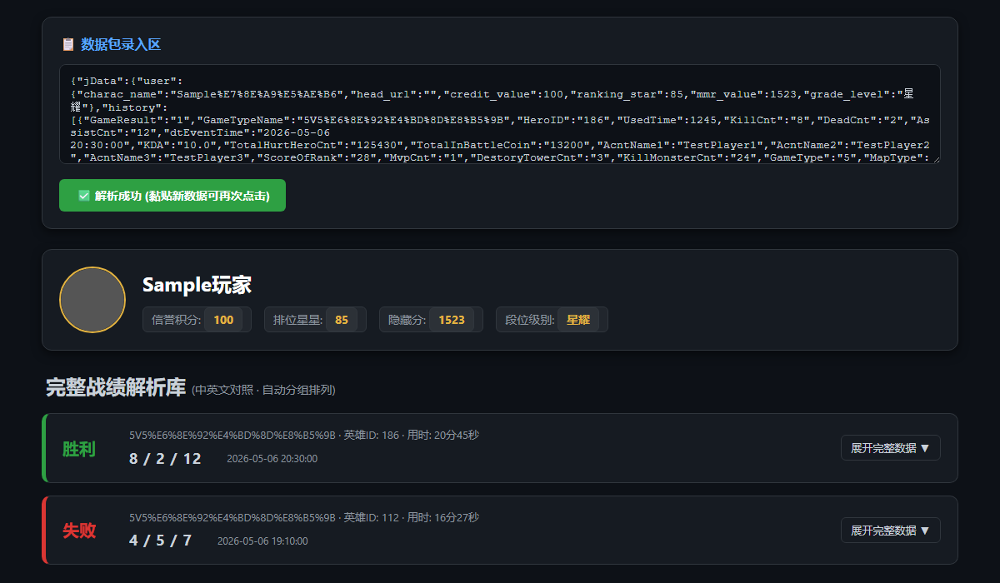
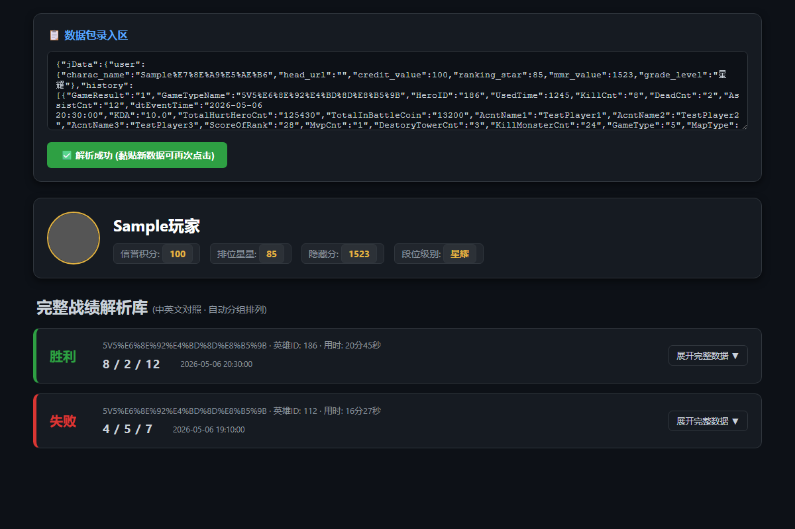

# 王者荣耀人机识别器

一个用于抓取王者荣耀历史战绩并识别人机玩家的本地工具。通过自动化浏览器拦截官方数据接口，分析原始战绩数据中的关键字段，精准识别对局中的人机队友与对手，并将结果渲染为交互式看板。


---

## 功能特性

### 人机识别（核心亮点）

王者荣耀在低段位对局中会混入大量 AI 人机玩家，官方不提供显式标识，玩家难以辨别。本工具通过分析战绩数据中的隐藏字段，提供两种精准的人机识别方法：

- **队友昵称识别**：在战绩看板的队友信息中，查看每位队友的昵称字段。若队友昵称为 **"暂无"**，则该队友为人机玩家。
- **排位暖局识别**：系统返回的 `WarmBattle` 字段标识了"福利局"状态。若 `WarmBattle` 代码为 **1000**，则本局为系统安排的福利局，敌方 5 名玩家均为人机。

通过以上两种方式，玩家可以准确判断对局中的人机数量，了解对局的真实质量。

### 其他功能

- **自动化数据抓取**：启动系统浏览器，引导用户完成 QQ/微信扫码登录，自动拦截官方战绩数据接口
- **本地数据备份**：将抓取到的原始 JSON 数据以日期为前缀保存到本地（如 `2026-05-06_history.json`）
- **交互式战绩看板**：单文件 HTML 仪表盘，无需服务器，直接在浏览器中展示
  - 玩家信息头部（头像、昵称、信用分、段位、MMR）
  - 每场对局的胜负状态与 KDA 概览卡片
  - 可展开的详细数据面板，涵盖 8 大数据维度：
    - 基础对局信息（模式、地图、时间、服务器）
    - 战斗表现（KDA、MVP、连杀记录）
    - 经济与伤害（金币、输出/承伤）
    - 推进贡献（推塔、补刀、打龙）
    - 行为与装备（出装、挂机/断线记录）
    - 队友信息（队友昵称、MVP 评分）
    - 系统参数（PvP 等级、大乱斗数据）
    - 其他字段

## 截图

**数据看板预览（输入区 + 战绩列表）：**



**完整看板全页截图：**



## 环境要求

- Python 3.7+
- Microsoft Edge 或 Google Chrome 浏览器
- 有效的王者荣耀账号（QQ 或微信）

## 安装与使用

**1. 克隆仓库**

```bash
git clone https://github.com/as167888/Honor-of-Kings-Match-Statistics.git
cd Honor-of-Kings-Match-Statistics
```

**2. 安装依赖**

```bash
pip install playwright
```

**3. 运行**

```bash
python main.py
```

**4. 按照控制台提示操作**

1. 程序自动打开浏览器并跳转至官方战绩页面
2. 在浏览器中完成微信/QQ 扫码登录
3. 选择要查询的游戏大区和角色
4. 回到控制台按下回车，程序自动抓取并解析数据
5. 浏览器自动跳转至战绩看板，查看完毕后再次按回车退出

## 打包为独立 EXE（可选）

使用 PyInstaller 将项目打包为无需 Python 环境的独立可执行文件：

```bash
pip install pyinstaller
pyinstaller --onefile --add-data "viewer.html;." main.py
```

打包完成后，`dist/main.exe` 即为可直接分发的独立程序，`viewer.html` 已内嵌其中。

## 项目结构

```
.
├── main.py        # 核心脚本：浏览器自动化与数据抓取
├── viewer.html    # 战绩可视化看板（纯前端，无依赖）
└── README.md
```

## 工作原理

`main.py` 使用 Playwright 启动系统已安装的 Edge/Chrome 浏览器（非 Playwright 内置 Chromium），监听页面的网络响应。当检测到包含 `AcntName2` 字段的 JSON 响应时，判定为目标战绩数据并完成捕获。

`viewer.html` 是一个完全独立的前端文件，通过解析传入的 JSON 数据，将 100+ 个游戏字段映射为中文标签并分类展示。人机识别功能通过分析 `WarmBattle` 字段及队友昵称数据实现，结果直观展示在战绩看板中。

## 注意事项

- 本工具仅读取官方页面的公开数据接口，不修改任何游戏数据
- 数据仅保存在本地，不上传至任何第三方服务器
- 若官方接口结构发生变更，抓取逻辑可能需要相应更新

## License

[MIT](LICENSE)
